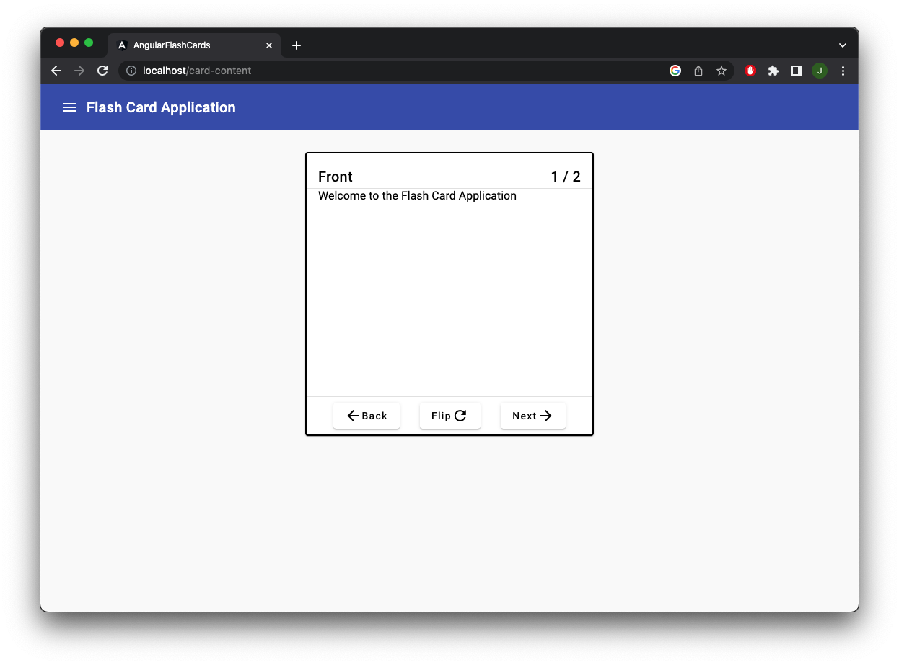

# Flash Card Application

# About the project
This project is mainly used for practicing different framework and tools.
More feature will be added in the future.
The data will be deleted after the application is stop.

Built with
- Spring Boot
- Angular
- Angular Material UI
- Postgres
- Nginx
- Docker

# Screenshots
The view of a card


The UI for card management


# Getting started
Make sure you have Docker and Docker Compose installed

1. Clone the proejct and nevigate to the source folder
```
git clone https://github.com/hontinghk/flash-cards.git
cd flash-cards
```
2. Build Docker image
```
docker compose build
```
3. Run Docker container
```
docker compose run
```
4. Test the applciation on http://localhost:80

# TODO
1. Add user authentication
2. Add category for card
3. Allow user to save data on production mode
